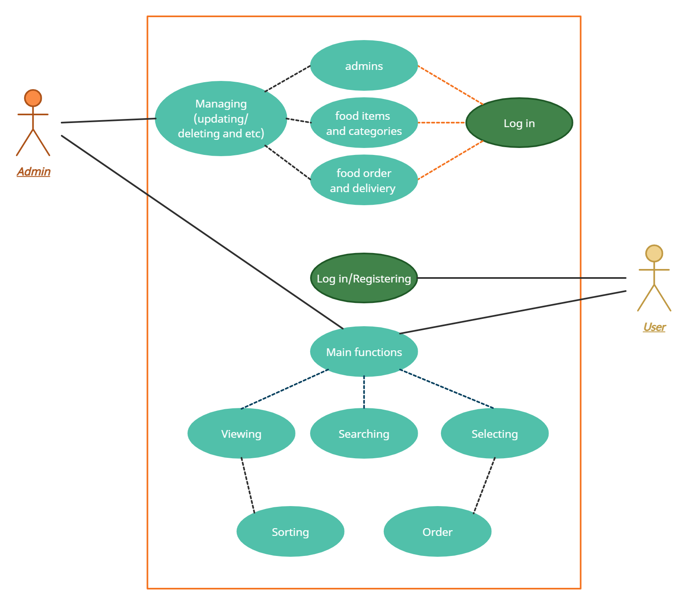

# Crysis
DB3project

## Goal description:

###### The idea of the application is to let people order various type of foods.

## Application description:

###### Building application that uses big amount of data consisting list of foods. Users are required to create an account on the website. With those accounts, they can order food to the desired address. It is easy to explore food taste by our simple-usable website.

## Benefits:

###### Despite the increasing number of high-quality sites for ordering food, sometimes there are tasteless and inconvenient sites to use. So, here list of benefits:
-	Convenience
-	More variety
-	Simple understanding website, without useless information and function
-	No advertisement
-	Feature for cancelling order

## Scope:

###### We are going to spend whole semester to finish this project. It’s about 2 month.

## Platform: 

###### Web

## Stack

-	Programming language:  PhP
-	Frontend: html, css, javascript
-	Database: Mysql

## Functions:
-	Login/sign up to become an admin
-	Users can view all the foods items and categories separately
-	Search-bar for the finding desired food
-	Easily ordering feature
-	Admin has the ability to manage admin, categories and food items
-	Also, he can  manage(updating/deleting) and track food order and delivery
-	The website is responsive to all mainstream screen sizes.

## 15 Questions that the project answers:

1. How to display Foods that are Active and available to order?
2. Can we retrieve all information about food categories?
3. How to get foods based on selected Category?
4. How to find and get foods based on search?
5. Can we retrieve information about the details of the selected food?
6. Is it possible to delete admin?
7. How to get all the orders from database?
8. How to get total revenue generated of order?
9. How to check whether the user with username and password exists or not?
10. How to get Foods from Database that are active and featured?
11. Is it possible to delete food data from Database?
12. Can we retrieve list of all admins?
13. How can we save the order in database?
14. How to get the category Title Based on Category ID?
15. How to update the Password?

## UML Case

